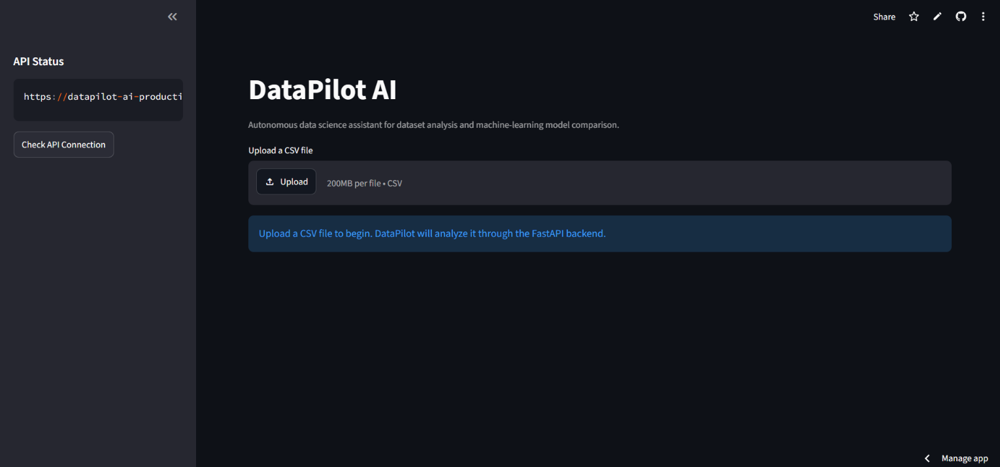

# DataPilot AI


**DataPilot AI** is an end-to-end machine-learning application that turns a CSV dataset into an automated analysis and model-comparison workflow. A Streamlit frontend sends data to a FastAPI backend, which detects the prediction problem, preprocesses features, trains multiple models, evaluates them, and returns the results.

## Demo



### Live Demo

[Open DataPilot AI](https://datapilot-ai-apqmxbl39yklcfcuy23fet.streamlit.app/)

## Why this project

Data science workflows often require repetitive setup before model experimentation can begin. DataPilot AI reduces that friction by automating common steps such as dataset inspection, target selection, problem-type detection, preprocessing, model training, and metric comparison behind a simple web interface.

## Core features

- Upload and inspect CSV datasets
- Preview rows, columns, missing values, duplicates, and column metadata
- Select a prediction target
- Automatically detect **classification** or **regression**
- Handle missing values and categorical features automatically
- Scale numerical features and one-hot encode categorical features
- Split data into training and testing sets
- Train and compare multiple machine-learning models
- Evaluate classification and regression performance
- Download model-comparison results as CSV
- FastAPI REST backend with interactive Swagger documentation
- Dockerized backend deployment on Railway
- Streamlit frontend deployment on Streamlit Community Cloud
- Automated tests with GitHub Actions CI

## Architecture

```text
User Browser
    |
    v
Streamlit Frontend
    |
    | HTTPS / JSON / multipart requests
    v
FastAPI Backend (Railway)
    |
    v
Preprocessing Pipeline
    |
    v
ML Model Training + Evaluation
    |
    v
Results returned to Streamlit
```

## Technology stack

| Area | Technologies |
| --- | --- |
| Frontend | Streamlit, Pandas |
| Backend | FastAPI, Uvicorn |
| Machine Learning | scikit-learn, XGBoost |
| Data Processing | Pandas, NumPy |
| Model Utilities | Joblib, Optuna |
| Persistence | SQLite |
| Deployment | Railway, Streamlit Community Cloud, Docker |
| Testing / CI | Pytest, GitHub Actions |

## Models

For classification, DataPilot AI can train models such as Logistic Regression, Random Forest, and XGBoost when available.

For regression, it can train models such as Linear Regression, Random Forest Regressor, and XGBoost Regressor when available.

Model availability is handled independently so one optional model failure does not stop the complete training workflow.

## API

The deployed FastAPI backend is available at:

- Health check: `https://datapilot-ai-production-8dd3.up.railway.app/health`
- Interactive API docs: `https://datapilot-ai-production-8dd3.up.railway.app/docs`

Main endpoints:

| Method | Endpoint | Purpose |
| --- | --- | --- |
| `GET` | `/` | API information |
| `GET` | `/health` | Service health check |
| `POST` | `/analyze` | Analyze an uploaded CSV |
| `POST` | `/detect-problem` | Detect classification or regression |
| `POST` | `/train` | Preprocess data, train models, and return results |

## Run locally

### 1. Clone the repository

```bash
git clone https://github.com/amber1714/datapilot-ai.git
cd datapilot-ai
```

### 2. Install dependencies

On Windows, using the Python launcher:

```bash
py -m pip install -r requirements.txt
```

### 3. Start the FastAPI backend

```bash
py -m uvicorn api.main:app --reload
```

The local API will be available at `http://127.0.0.1:8000` and the Swagger docs at `http://127.0.0.1:8000/docs`.

### 4. Start Streamlit

Open a second terminal:

```bash
py -m streamlit run streamlit_app.py
```

The frontend will normally open at `http://localhost:8501`.

## Backend configuration

The Streamlit frontend reads the backend URL from the `DATAPILOT_API_URL` environment variable.

For local development, it falls back to:

```text
http://127.0.0.1:8000
```

For deployment, set it to the Railway base URL, for example:

```text
https://datapilot-ai-production-8dd3.up.railway.app
```

## Tests

Install the test dependencies and run the test suite:

```bash
py -m pip install -r requirements-test.txt
py -m pytest tests -q
```

GitHub Actions automatically runs the tests on pushes and pull requests targeting `main`.

## Project structure

```text
datapilot-ai/
├── api/                  # FastAPI application
├── database/             # Experiment-history persistence
├── ml/                   # Detection, preprocessing, training and evaluation
├── sample_data/          # Example CSV datasets
├── services/             # Streamlit-to-FastAPI HTTP client
├── tests/                # Automated tests
├── .github/workflows/    # GitHub Actions CI
├── Dockerfile            # Backend container image
├── railway.toml          # Railway deployment configuration
├── streamlit_app.py      # Streamlit frontend
├── requirements.txt      # Frontend / project dependencies
├── requirements-api.txt  # Backend dependencies
└── requirements-test.txt # Test dependencies
```

## Sample data

Example datasets are available in `sample_data/`, including classification and regression examples for quickly testing the workflow.

## Current deployment

- **Frontend:** Streamlit Community Cloud
- **Backend:** Railway
- **CI:** GitHub Actions

## Future improvements

Potential extensions include richer explainability with SHAP, automated feature engineering, model versioning, dataset profiling reports, authentication, persistent cloud experiment history, and support for additional model families.

## Author

**Amber Rodrigues**  
M.Tech Artificial Intelligence  
GitHub: [amber1714](https://github.com/amber1714)
